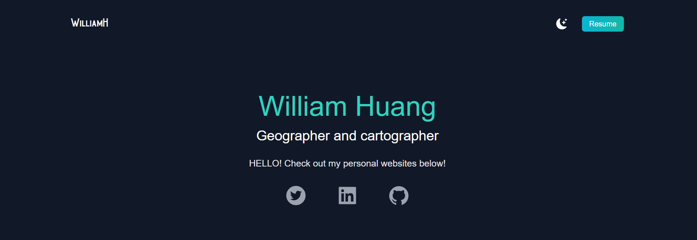

# React-Portfolio
    If you want to view the code, please follow the steps below.

## Installation
    After git clone the repo into youre local, run command "npm i".

## Usage
    After installations are completed, run the app with "npm run dev".

## Mock Up

## Live Site
